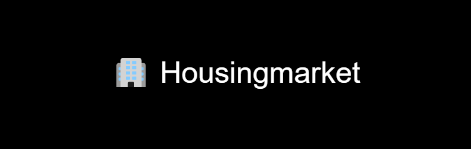

# Housing market

Housing market is a agent based model that aims to easily model different consumer behaviour patterns for a given house market.

## Table of contents
- [About](#about)
- [How To Use](#how-to-use)
- [Overview](#overview)
- [Lincese](#license)
- [Sources](#sources)

## About
The agent have been coded as following:

In the picture we see that agent have a wide variaty of attributes.

The model also has many attributes need for communincating between different agents and storing data.

## How To Use
To use the following model configure the parameters specified inside the run file. The model has 4 starting parameters. Amount of houses, Amount of agents, height and width of the city.

## Overview
Below you find some of the data extracted from runs with this model.

## Lincese

## Sources
https://www.oecd.org/naec/ABM_housing_example_A_Carro.pdf
https://www.cbs.nl/nl-nl/visualisaties/inkomensverdeling
https://www.funda.nl/

## Coming Features
